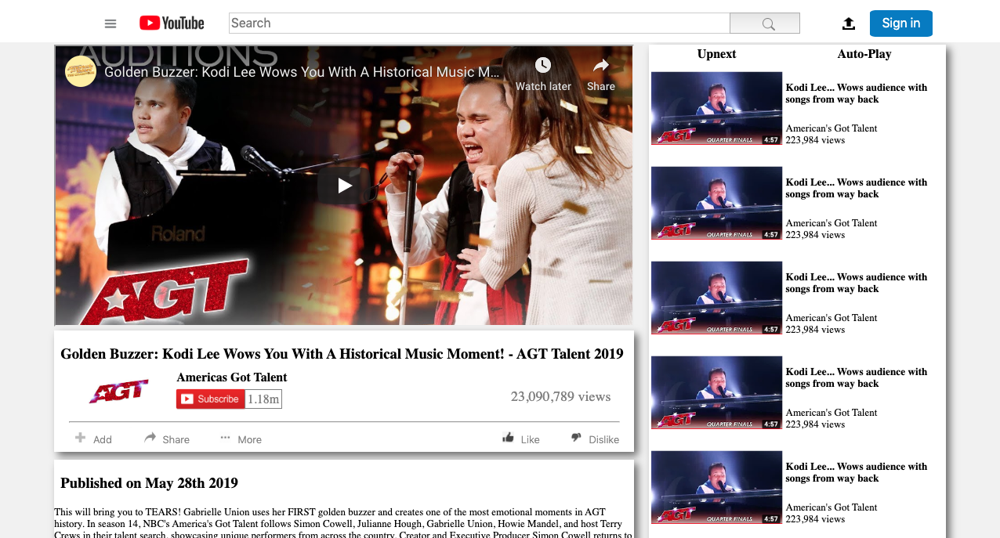

# Youtube_Video_Player_Page_Clone

> This collabaorative project is building an HTML document that matches the structure of youtube video player page
using css for styling.

With Reference to the actual youtube page , there are a number of elements that it consists of which some have been implemented.

## Getting Started

Below you will see the general components of this page.

**Navigation Bar**

This element consists of the following:
* Menu icon
* YouTube Logo
* Input field
* Search button
* Upload icon
* Sign In Button

**Main Section**

This section consists of the following:
* Embedded video and Video information
* Video side bar that has thumbnails with video suggestions

**Footer**

This section basically contains links to outside pages.

## Built With

* HTML
* CSS

## Live Demo

[Click here](https://htmlpreview.github.io/?https://github.com/Elbie-em/Youtube_Video_Player_Page/blob/youtube_page_clone_feature_b/index.html) to see a live demo.

###### Author 1

Elbie Moonga
[GitHub](https://github.com/Elbie-em)
[Twitter](https://twitter.com/ElbieEm)
[LinkedIn](https://www.linkedin.com/in/elbie-moonga-253bbb12b/)

###### Author 2
Ezeokwelume Kosisochukwu Stephen
[GitHub](https://github.com/KossySteve)
[Twitter](https://twitter.com/EzeSteve3/)
[LinkedIn](https://www.linkedin.com/in/steve-ez-b090ba198/)

## Contributions

Contributions, issues and feature requests are welcome to this project. Feel free to reach out.

## Give us Support

You can give a star if you like this project.
